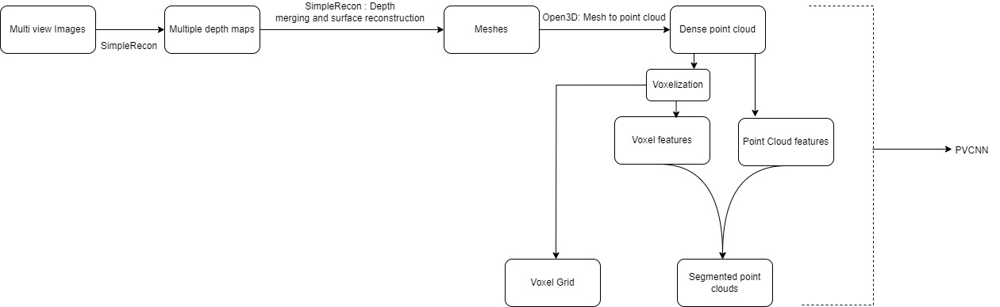
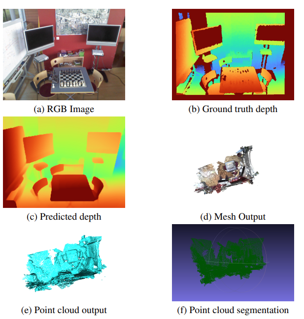

# 3D mapping and Object Segmentation
## Abstract
Indoor navigation for robots has become a crucial part
of their use in such environments. Mapping an environment
allows autonomous navigation to detect and avoid obstacles. In this paper, we present a novel approach that utilizes RGB images to segment indoor environments. The paper introduces a method for indoor mapping that can be
used for robot navigation by first creating a 3D mesh from
Multi-View Stereo (MVS) RGB images and then converting
this mesh into a point cloud for environmental segmentation. We carry out experiments to establish a baseline for
our method. We present our findings and provide avenues
for future work.

## Pipeline

## Results
Our  explanation of the results can be found [here](./848f_final_report.pdf). A sample has been displayed below.

## Credits
We would like to thank the authors of the respective papers whose work we used and for opensourcing their code on github.

1. [Simple Recon](https://nianticlabs.github.io/simplerecon/)

2. [PVCNN](https://github.com/mit-han-lab/pvcnn/tree/master)

I would also like to thank my teammates for their contributions and ideas in this project.
1. [Nishant](https://github.com/nishantpandey4)

2. [Rishikesh](https://github.com/Rishikesh-Jadhav)